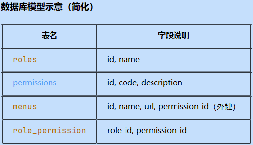
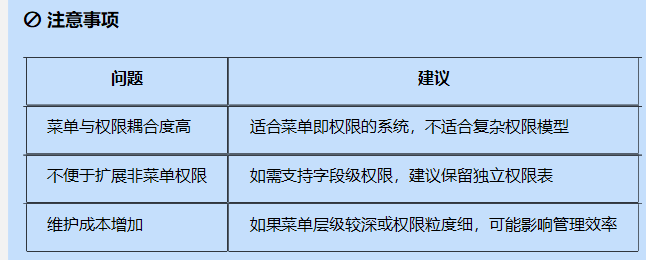
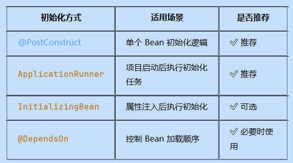

参数校验    1

全局异常处理 1

登录功能，（解决跨域问题）  服务添加跨域配置

角色鉴权（自定义鉴权注解）  后续添加

实现用户相关接口、（注册、登录、退出登录、修改密码、用户信息【去除密码】)

角色接口 1

权限接口 1

角色权限关联表接口（角色id、权限id）

用户角色关联表接口（用户id、角色id）  新增用户角色关联、新增用户角色关联、查询用户角色关联
方案一，四张表

方案二，三张表，将权限和菜单表合并。适用于菜单即权限

对权限表进行扩字段，加上菜单信息，实现角色与菜单的关联。同时添加菜单的组件信息。从而实现vue的动态路由功能


blog相关接口

标签（新增、删除【真实】、查询List<Map>、查询分页）

分类（新增、删除【真实】、查询List<Map>、查询分页）

文章标题(新增、修改、查询分页)

文章内容（新增、修改、查询）


文章新增业务层：标签、分类、文章标题、文章内容等服务组装使用




✅ 一、项目初始化时加载数据进入 Redis
1. 使用 @PostConstruct 注解
   适用于在 Bean 初始化阶段加载数据到 Redis。
2. 使用 ApplicationRunner 或 CommandLineRunner
   这两个接口会在 Spring 容器启动完成后执行，适合执行一些初始化任务。


**遇到的问题**
**深拷贝**
需要从 原对象（复杂对象） 创建一个新的对象，并对其进行处理
如果使用  newObject = sourceObject 那么后续对newObject的处理都会影响到sourceObject
因此需要通过深拷贝的方式创建新的对象 将原对象的所有数据拷贝到新对象中。
选用Json序列化与反序列化 反而是最简单的。

**数据库一条记录，需要拆分出多个不同节点的数据**
一条记录对应一个对象实例。拆分数据，需要将数据拆分到多个节点中。
1、创建一个配置类，先区分出该条记录需要拆分为哪些节点。（优化了多个if判断条件）
2、生成所需节点，按照配置类中的信息生成对应节点。
3、每个节点的属性设置：由于不同节点所需属性不同，取得字段值也不同，因此采用**反射**来获取对象里的字段值。（使用反射，避免了不同节点中反复get字段、后续新增属性时，直接修改map即可）
先设计Map key:对象中的字段名 value:需要生成的属性code。
案例代码
```
LDAP_ATTR_CODE_MAP.put("loginId","Login ID,PM_LDAP_LOGIN_ID");
        LDAP_ATTR_CODE_MAP.put("loginPassword","Initial Password,PM_LDAP_INIT_PW");
        LDAP_ATTR_CODE_MAP.put("domain","Domain,PM_LDAP_DOMAIN");
        
LDAP_ATTR_CODE_MAP.forEach((attrCode,attrName) -> {
            PropertyVo propertyVo = new PropertyVo();
            try {
                Field field = entity.getClass().getDeclaredField(attrCode);
                field.setAccessible(true); // 允许访问私有字段
                String value = String.valueOf(field.get(entity));
                propertyVo.setAttrName(attrName.split(",")[0]);
                propertyVo.setAttrCode(attrName.split(",")[1]);
                if ("loginPassword".equals(attrCode)){
                    propertyVo.setAttrValue(newPwd);
                }else {
                    propertyVo.setAttrValue(value);
                }
                propertyVoList.add(propertyVo);
            } catch (NoSuchFieldException | IllegalAccessException e) {
                System.err.println("反射获取字段失败: " + attrCode + ", error: " + e.getMessage());
            }
        });
```
